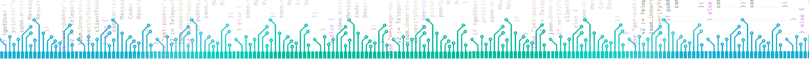

- <b>jlywxy</b> 
📧mail: jlywxy@outlook.com 
🔨Tech: Embedded Software/Hardware(Electronics), Mobile/PC Application(iOS, Electron, Golang). 
💻Job: (nil,finding) 
- <b>Working Projects</b> 
🌰SlimARM: ARM core boards. <a href="//github.com/jlywxy/slimarm">slimarm</a> 
💡Color SPU Strip: A sound-pickup light strip. <a href="//github.com/jlywxy/color-spu-strip">color-spu-strip</a> 
🖥LCD interface tests: 
LS050T1SX01(Sharp,DSI)+SSD2828. <a href="//github.com/jlywxy/mipi-lcd-sharp-ssd2828">mipi-lcd-sharp-ssd2828</a> 
A030DW01(AUO,RGB8)+FPGA. <a href="//github.com/jlywxy/parallel-lcd-auo-fpga">parallel-lcd-auo-fpga</a> 
G070VW01(AUO,LVDS)+FPGA. <a href="//github.com/jlywxy/lvds-lcd-auo-fpga">lvds-lcd-auo-fpga</a> 
...
